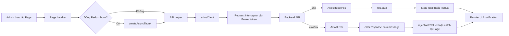
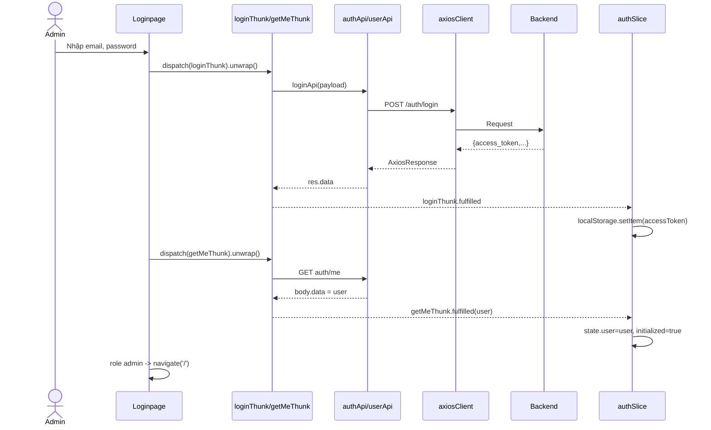
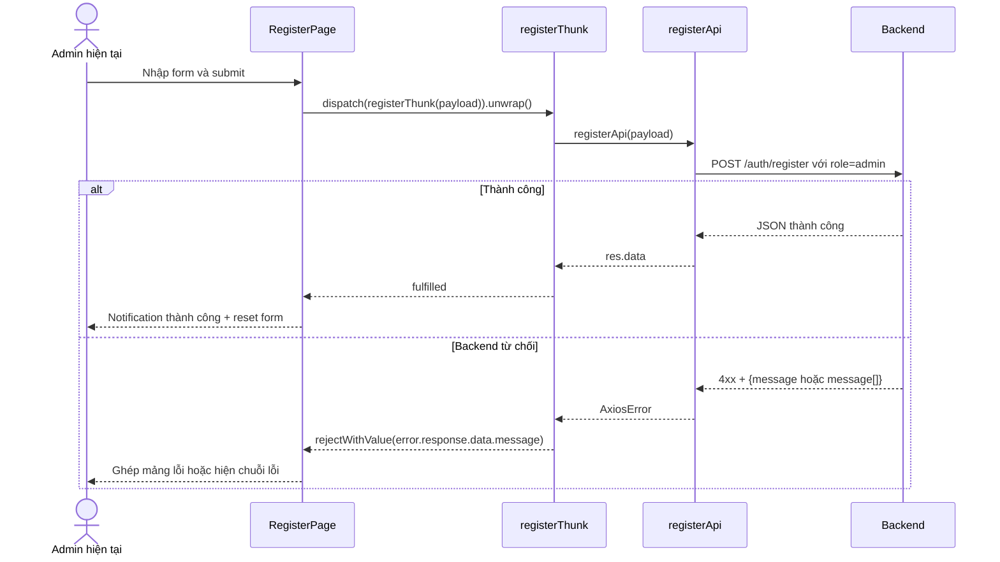
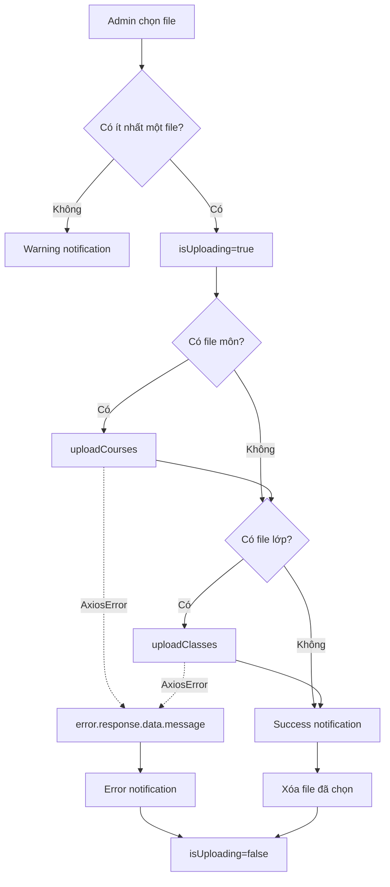

# Smart Schedule — Luồng Admin và cách lấy dữ liệu Axios

> Phạm vi: frontend React trong dự án `fe_smart_schedule`. Tài liệu đối chiếu trực tiếp các route, page, API helper, Redux thunk/slice và component dùng chung đang có trong mã nguồn.

## 1. Kết luận ngắn gọn về `res.data`

`res.data` là **body do backend trả về** nằm bên trong `AxiosResponse`.

```ts
const res = await axiosClient.get('/courses');
// res                 : toàn bộ AxiosResponse
// res.status          : HTTP status
// res.headers         : response headers
// res.data            : JSON/body backend trả về
```

Tuy nhiên, câu “ở đâu cũng bắt buộc viết `.data`” chưa hoàn toàn chính xác. Phải xét tầng ngay trước đó đã bóc body hay chưa:

```ts
// API helper đã bóc body
const loginApi = async (payload) => {
  const res = await axiosClient.post('/auth/login', payload);
  return res.data;
};

// Vì loginApi đã return res.data nên biến result chính là body.
const result = await loginApi(payload);
console.log(result.access_token); // đúng
// result.data chỉ đúng nếu chính body backend còn có một field tên data.
```

Hai đường lấy dữ liệu cần phân biệt:

```text
Thành công: AxiosResponse -> res.data -> body backend
Thất bại : AxiosError    -> error.response.data -> body lỗi backend
```

Ví dụ cấu trúc lỗi:

```ts
error = {
  message: 'Request failed with status code 400', // thông báo chung của Axios
  response: {
    status: 400,
    data: {
      success: false,
      message: 'Mật khẩu không chính xác',        // thông báo của backend
    },
  },
};
```

Vì vậy, dự án lấy thông báo backend bằng:

```ts
error?.response?.data?.message || 'Thông báo mặc định'
```

Dấu `?.` ngăn lỗi JavaScript khi request chưa nhận được response, chẳng hạn mất mạng hoặc backend không chạy. `||` cung cấp thông báo dự phòng.

## 2. Ba kiểu response đang tồn tại trong dự án

### Kiểu A — API helper trả body trực tiếp

Ví dụ `auth-api.ts`, `dashboard-api.ts`, `upload-api.ts`:

```ts
const res = await axiosClient.post('/auth/login', payload);
return res.data;
```

Tầng gọi phía sau nhận ngay body:

```ts
const result = await loginApi(payload);
result.access_token;
```

### Kiểu B — API helper trả nguyên `AxiosResponse`

Ví dụ `semester-api.ts`:

```ts
getAll: () => axiosClient.get('/semesters')
```

Page phải bóc body:

```ts
const semestersRes = await semesterApi.getAll();
setSemesters(semestersRes.data ?? []);
```

### Kiểu C — body backend có thêm envelope `data`

Giả sử backend trả:

```json
{
  "success": true,
  "data": {
    "student_id": "...",
    "full_name": "...",
    "role": "admin"
  }
}
```

Khi đó có hai lần `.data`, nhưng chúng thuộc hai tầng khác nhau:

```ts
// user-api.ts: lần 1, AxiosResponse -> body
const res = await axiosClient.get('auth/me');
return res.data;

// auth-thunk.ts: lần 2, body -> field data của backend
const res = await userRoleUserApi.get();
return res.data;
```

Đây chính là luồng hiện tại của `getMeThunk`.

## 3. Kiến trúc luồng dữ liệu toàn frontend



Các tầng chính:

| Tầng | File tiêu biểu | Trách nhiệm |
|---|---|---|
| Axios dùng chung | `src/shared/lib/axios.ts` | base URL, JSON header, gắn token, xử lý 401 |
| API helper | `src/features/**/api/*.ts` | khai báo endpoint, payload, bóc hoặc giữ AxiosResponse |
| Redux async | `auth-thunk.ts` | gọi API, chuẩn hóa lỗi bằng `rejectWithValue` |
| Redux state | `auth-slice.ts` | lưu token, user, loading, error, initialized |
| Page/component | `Dashboard`, `RegisterPage`, `CourseClassPage`... | xử lý hành vi, cập nhật state, hiển thị thông báo |
| Dùng chung | `useTable`, `ModalFormCustom`, `useNotification` | tái sử dụng tải bảng, CRUD modal và notification |

## 4. Axios client, token và lỗi 401

File: `src/shared/lib/axios.ts`.

```ts
export const axiosClient = axios.create({
  baseURL: import.meta.env.VITE_API_URL,
  headers: { 'Content-Type': 'application/json' },
});
```

Mọi URL tương đối như `/courses` được ghép với `VITE_API_URL`.

Trước mỗi request:

```ts
const accessToken = localStorage.getItem('accessToken');
if (accessToken) {
  config.headers['Authorization'] = `Bearer ${accessToken}`;
}
```

Khi backend trả `401`:

```ts
if (error.response?.status === HTTP_STATUS.UNAUTHORIZED) {
  localStorage.removeItem('accessToken');
  window.location.href = '/auth/login';
}
return Promise.reject(error);
```

Interceptor chỉ xử lý phiên hết hạn; các lỗi nghiệp vụ khác tiếp tục được `Promise.reject(error)` đưa về thunk/page để lấy `error.response.data.message`.

## 5. Luồng vào hệ thống của Admin

### 5.1 Khởi tạo ứng dụng và khôi phục phiên

`App.tsx` bọc ứng dụng theo thứ tự `Redux Provider -> AntdProvider -> AppInit -> RouterProvider`.

Trong `AppInit.tsx`:

```ts
const token = localStorage.getItem('accessToken');
if (token) dispatch(getMeThunk());
else dispatch(markInitialized());
```

`ProtectedRoute` chờ `initialized`. Nếu route cần đăng nhập mà không có `user`, nó chuyển đến `/auth/login`. Nếu đã có `user` mà truy cập login/register, nó chuyển về `/`.

### 5.2 Đăng nhập Admin

Các file: `Loginpage.tsx` → `auth-thunk.ts` → `auth-api.ts` → `auth-slice.ts`.



Đường dữ liệu token:

```ts
// auth-api.ts
const res = await axiosClient.post('/auth/login', payload);
return res.data;

// auth-thunk.ts
const res = await loginApi(payload);
return res;

// auth-slice.ts
localStorage.setItem('accessToken', action.payload.access_token);
```

Đường lỗi:

```ts
// thunk bóc thông báo backend
return thunkAPI.rejectWithValue(
  error.response?.data?.message || 'Đăng nhập thất bại'
);

// unwrap() làm rejected payload bị throw vào catch của Page
catch (error) {
  showNotification(
    'error',
    'Đăng nhập thất bại',
    typeof error === 'string' ? error : 'Đã xảy ra lỗi. Vui lòng thử lại.'
  );
}
```

### 5.3 Menu và route Admin

`AppSidebar.tsx` chỉ hiển thị cho role `admin`:

| Menu | Route | Page |
|---|---|---|
| Dashboard | `/` | `DashBoard.tsx` |
| Thêm Môn học | `/addCourses` | `CourseClassPage.tsx` |
| Cấp tài khoản | `/create-admin` | `RegisterPage isAdminMode` |
| Import Thời khóa biểu | `/import-schedule` | `ImportSchedulePage.tsx` |
| Thông tin cá nhân | `/profile` | `ProfilePage.tsx` |

Lưu ý bảo mật: sidebar có lọc menu theo role nhưng `routes.tsx` hiện chỉ kiểm tra “đã đăng nhập”, chưa kiểm tra role cho từng route. Một student đã đăng nhập vẫn có thể nhập trực tiếp URL Admin. Backend vẫn phải kiểm tra quyền; frontend nên bổ sung `allowedRoles` cho `ProtectedRoute`.

## 6. Page Dashboard — thống kê và học kỳ

Route `/`, file `src/features/Dashboard/Pages/DashBoard.tsx`.

Page gọi song song năm nguồn bằng `Promise.allSettled`:

| Lời gọi | Endpoint | Helper trả về | Page lấy dữ liệu |
|---|---|---|---|
| `getCourseQuantity()` | `GET /courses/quantity` | `res.data` | dùng trực tiếp `coursesRes.value` |
| `getClassQuantity()` | `GET /classes/quantity` | `res.data` | dùng trực tiếp `classesRes.value` |
| `getActiveSemester()` | `GET /semesters/active` | toàn bộ AxiosResponse | `activeSemRes.value.data` |
| `semesterApi.getAll()` | `GET /semesters` | toàn bộ AxiosResponse | `semestersRes.value.data` |
| `getAlgorithmCounts()` | `GET /schedules/stats` | `res.data` | dùng trực tiếp rồi đọc `.total`, `.data` |

Đoạn thể hiện rõ hai phong cách:

```ts
if (coursesRes.status === 'fulfilled') {
  setTotalCourses(coursesRes.value);       // helper đã bóc res.data
}
if (activeSemRes.status === 'fulfilled') {
  setActiveSemester(activeSemRes.value.data ?? null); // helper giữ AxiosResponse
}
```

`algorithmCounts` có body dạng:

```ts
interface AlgorithmCountResponse {
  data: { algorithm: string; count: number }[];
  total: number;
}
```

Vì `dashboardApi.getAlgorithmCounts()` đã `return res.data`, `.data` tại `algorithmCounts.data.map(...)` là field của JSON backend, không còn là `.data` của Axios.

Luồng học kỳ:

- Chọn học kỳ → `PATCH /semesters/:id/activate` → cập nhật `activeSemester` từ danh sách local.
- Thêm học kỳ → validate form → `POST /semesters` → gọi lại `GET /semesters` → `setSemesters(semestersRes.data ?? [])`.
- Lỗi tạo học kỳ lấy `error?.response?.data?.message`.
- Lỗi đổi học kỳ hiện dùng thông báo cố định và chưa lấy message backend.

`Promise.allSettled` giúp một request lỗi không làm mất toàn bộ dashboard. Mỗi kết quả cần kiểm tra `status`. Khối `catch` ngoài hầu như không nhận lỗi riêng lẻ vì `allSettled` không reject khi một promise con thất bại.

## 7. Page Cấp tài khoản Admin

Route `/create-admin`, dùng lại `RegisterPage` với `isAdminMode={true}`.

Page biến đổi field giao diện thành payload backend:

```ts
registerThunk({
  student_id: values.massv,
  name: values.fullName,
  email: values.email,
  password: values.password,
  role: USER_ROLE.ADMIN,
});
```

Luồng:



`RegisterPage` xử lý cả trường hợp backend trả mảng message:

```ts
const errorMsg = Array.isArray(error) ? error.join(', ') : error;
showNotification('error', 'Đăng ký thất bại', errorMsg || '...');
```

## 8. Page Quản lý khóa học và lớp học

Route `/addCourses`, page `CourseClassPage.tsx`.

### 8.1 Tải bảng khóa học

`courseApi.getAll()` gọi `GET /courses`, nhận `res.data` là mảng, sau đó tự phân trang phía client và **đóng gói lại** thành:

```ts
return {
  data: {
    items,
    pagination: { total, page, limit },
  },
};
```

Đây không còn là AxiosResponse; nó chỉ là object được helper tạo theo hợp đồng của `useTable`:

```ts
const response = await fetchApi(params);
setData(response.data.items || []);
setPagination(response.data.pagination);
```

Vì vậy, `.data` trong `useTable` là key quy ước nội bộ. Không phải mọi `.data` nhìn thấy trong code đều do Axios tạo ra.

### 8.2 CRUD khóa học

| Hành động | Endpoint | Nơi bắt thành công | Nơi bắt lỗi |
|---|---|---|---|
| Thêm | `POST /courses` | `ModalFormCustom` notification | `error.response.data.message` |
| Sửa | `PATCH /courses/:id` | `ModalFormCustom` notification | `error.response.data.message` |
| Xóa | `DELETE /courses/:id` | `useTable`, dùng `res.message` | `error.response.data.message` |
| Xem/lấy lớp | `GET /courses/:id` | `ClassManagementDrawer` | thông báo cố định khi tải lỗi |

`courseApi.create/update/remove` đều `return res.data`, nên component dùng `res.message`, không dùng `res.data.message`.

### 8.3 Drawer quản lý lớp

Khi mở drawer:

```ts
const res = await courseApi.getDetail(courseId); // helper đã return Axios body
const courseData = res.data || res;
setClasses(courseData.classes || []);
```

`res.data || res` đang hỗ trợ đồng thời hai body shape:

```json
{"data":{"classes":[]}}
```

hoặc:

```json
{"course_id":"...","classes":[]}
```

Thêm/sửa/xóa lớp gọi `classApi`, nhưng `classApi` trả nguyên AxiosResponse. Page chỉ chờ hoàn tất nên chưa cần bóc body. Sau thành công, page gọi lại `fetchClasses()`.

Lỗi lớp hiện lấy:

```ts
error?.response?.data?.error?.message || 'Lưu lớp học thất bại'
```

Điểm này khác phần còn lại đang dùng `error.response.data.message`. Nếu backend không thực sự trả `{ error: { message } }`, thông báo thật sẽ bị bỏ qua. Nên dùng hàm chuẩn hóa hỗ trợ cả hai shape.

## 9. Page Import Excel

Route `/import-schedule`, file `ImportSchedulePage.tsx`.

Hai API:

```ts
POST /courses/upload-courses
POST /courses/upload-classes
```

Mỗi helper:

```ts
const formData = new FormData();
formData.append('file', file);
const res = await axiosClient.post(url, formData, {
  headers: { 'Content-Type': 'multipart/form-data' },
});
return res.data;
```

Luồng page:



Nếu upload file môn thành công nhưng file lớp thất bại, backend đã nhận file môn; UI đi vào `catch`, không reset file và không rollback. Đây là hai request độc lập, không phải một transaction chung.

## 10. Page Hồ sơ Admin

Route `/profile`, dùng cho cả Admin và student.

Thông tin ban đầu lấy từ `state.auth.user`, vốn đến từ `getMeThunk`.

Cập nhật tên:

```ts
await updateMeApi({ name: editName });
dispatch(getMeThunk()); // tải lại user vào Redux
```

Đổi mật khẩu:

```ts
await updateMeApi({ old_password: oldPw, password: newPw });
```

`updateMeApi` đã `return res.data`, nhưng page chỉ cần biết promise thành công nên không dùng body. Khi lỗi, page lấy:

```ts
e?.response?.data?.message || 'Cập nhật thất bại'
```

## 11. Notification: message đi từ backend đến màn hình như thế nào?

Có hai luồng.

### Luồng qua Redux thunk

```text
Backend {message}
-> AxiosError.response.data.message
-> thunkAPI.rejectWithValue(message)
-> rejected action.payload
-> dispatch(thunk).unwrap() throw payload
-> catch(error) tại Page
-> showNotification(..., error)
-> Ant Design notification
```

Áp dụng cho đăng nhập và cấp tài khoản.

### Luồng page/component gọi API trực tiếp

```text
Backend {message}
-> AxiosError.response.data.message
-> catch(error) tại Page/component
-> showNotification/message.error
-> Ant Design notification
```

Áp dụng cho Dashboard, khóa học/lớp, import và hồ sơ.

`useNotification` chỉ là lớp bọc Ant Design:

```ts
notification[type]({ title, description });
```

Nó không tự đọc AxiosError. Message phải được bóc trước khi gọi hook.

## 12. Bảng tra nhanh toàn bộ Admin

| Nghiệp vụ | Page | API helper | Đường success data | Đường error message |
|---|---|---|---|---|
| Đăng nhập | `Loginpage` | `loginApi` | `AxiosResponse.data -> thunk payload -> access_token` | `response.data.message -> rejectWithValue -> unwrap catch` |
| Lấy user/role | `AppInit`, `Loginpage` | `userRoleUserApi.get` | `AxiosResponse.data.data -> auth.user` | `response.data.message` |
| Dashboard count | `DashBoard` | `dashboardApi` | helper trả `res.data`, page dùng trực tiếp | phần tải đầu hiện không notification từng lỗi |
| Danh sách học kỳ | `DashBoard` | `semesterApi` | helper giữ response, page dùng `response.data` | tạo mới dùng `response.data.message` |
| Cấp Admin | `RegisterPage` | `registerApi` | helper trả `res.data`, page chỉ chờ fulfilled | thunk bóc `response.data.message` |
| Danh sách khóa học | `CourseClassPage` | `courseApi.getAll` | helper bóc body rồi đóng gói object `.data.items` | `useTable` hiện chỉ console khi fetch lỗi |
| CRUD khóa học | modal/useTable | `courseApi` | helper trả `res.data`; dùng `res.message` | `response.data.message` |
| CRUD lớp | drawer | `classApi` | helper giữ AxiosResponse; page chỉ await | `response.data.error.message` |
| Import | `ImportSchedulePage` | `uploadApi` | helper trả `res.data`; page đếm request thành công | `response.data.message` |
| Hồ sơ | `ProfilePage` | `updateMeApi` | helper trả `res.data`; page không cần body | `response.data.message` |

## 13. Các điểm nên chuẩn hóa

### 13.1 Chọn một quy ước cho API helper

Khuyến nghị mọi helper trả body:

```ts
const { data } = await axiosClient.get<ApiResponse<Semester[]>>('/semesters');
return data;
```

Khi đó page không phụ thuộc cấu trúc AxiosResponse và không trộn `value` với `value.data`.

### 13.2 Chuẩn hóa extractor lỗi

```ts
import axios from 'axios';

export const getApiErrorMessage = (error: unknown, fallback: string) => {
  if (!axios.isAxiosError(error)) return fallback;

  const body = error.response?.data as
    | { message?: string | string[]; error?: { message?: string } }
    | undefined;

  const message = body?.message ?? body?.error?.message;
  return Array.isArray(message) ? message.join(', ') : message || fallback;
};
```

Điều này loại bỏ `any`, hỗ trợ cả `message`, `message[]`, `error.message` và fallback.

### 13.3 Tách tên biến theo đúng tầng

Nên đặt:

```ts
const axiosResponse = await axiosClient.get(...);
const apiBody = axiosResponse.data;
const user = apiBody.data;
```

Tên rõ ràng giúp tránh nhầm `res.data.data`.

### 13.4 Bảo vệ route theo role

Ẩn menu không phải kiểm soát quyền. Nên cấu hình route Admin với `allowedRoles={['admin']}` và luôn giữ authorization ở backend.

## 14. Checklist đọc một đoạn `.data`

Khi thấy `.data`, kiểm tra theo thứ tự:

1. Biến đứng trước `.data` có phải object do Axios trả trực tiếp không? Nếu có, đây là body HTTP.
2. API helper đã `return res.data` chưa? Nếu rồi, tầng gọi không tự động cần `.data` nữa.
3. Body backend có envelope `{ data: ... }` không? Nếu có, `.data` tiếp theo là field JSON của backend.
4. Đây có phải object do code tự tạo như `{ data: { items, pagination } }` không?
5. Trong `catch`, dùng `error.response.data`, không dùng `res.data`.
6. Dùng optional chaining và fallback để tránh crash khi không có response.

Tóm lại: `.data` không phải cú pháp “mặc định cứ thêm vào”. Nó là thao tác bóc đúng một lớp dữ liệu. Muốn dùng đúng, phải biết biến hiện tại đang là `AxiosResponse`, body backend, hay object nội bộ do frontend tự đóng gói.
