# Phân tích và mã Mermaid sequence diagram — SmartSchedule

## Kết luận số lượng

Phạm vi được đối chiếu từ ba codebase:

- Frontend React: `fe_smart_schedule`
- Backend NestJS: `back_end-smart-schedule`
- Core thuật toán FastAPI/Python: `core_schedule`

Actor nghiệp vụ chỉ gồm **Sinh viên** và **Admin**.

Nên dùng **14 sơ đồ sequence** cho các luồng end-to-end đang được frontend sử dụng.

| # | Sơ đồ | Actor | Core AI |
|---|---|---|---|
| 1 | Đăng ký sinh viên và Admin cấp tài khoản | Sinh viên, Admin | Không |
| 2 | Đăng nhập, khôi phục phiên và đăng xuất | Sinh viên, Admin | Không |
| 3 | Xem và cập nhật hồ sơ | Sinh viên, Admin | Không |
| 4 | Xem Dashboard thống kê | Admin | Không |
| 5 | Quản lý học kỳ | Admin | Không |
| 6 | Quản lý môn học | Admin | Không |
| 7 | Quản lý lớp học | Admin | Không |
| 8 | Import môn học và lớp học bằng Excel | Admin | Không |
| 9 | Chọn, thay thế đăng ký môn và khởi động sinh lịch | Sinh viên | Có, mức tổng quan |
| 10 | Cấu hình buổi học và ngày tránh | Sinh viên | Có tác động ở lần sinh lịch sau |
| 11 | Quản lý khung giờ bận cá nhân | Sinh viên | Có tác động ở lần sinh lịch sau |
| 12 | Sinh và xếp hạng thời khóa biểu tối ưu | Sinh viên | Có, chi tiết CSP + OR-Tools + Scoring |
| 13 | Xác nhận phương án lịch | Sinh viên | Không |
| 14 | Xem lịch học đã xác nhận | Sinh viên | Không |

## 1. Đăng ký sinh viên và Admin cấp tài khoản

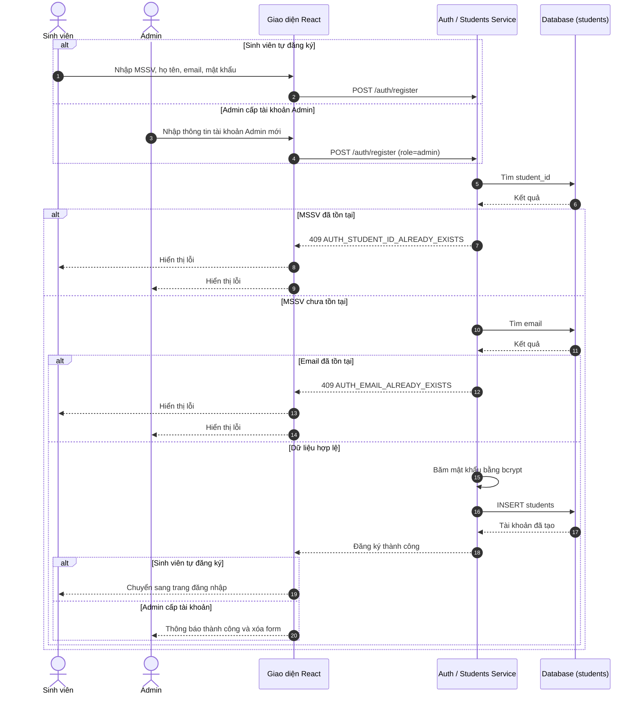
```mermaid
sequenceDiagram
    autonumber
    actor SV as Sinh viên
    actor AD as Admin
    participant UI as Giao diện React
    participant SVC as Auth / Students Service
    participant DB as Database (students)

    alt Sinh viên tự đăng ký
        SV->>UI: Nhập MSSV, họ tên, email, mật khẩu
        UI->>SVC: POST /auth/register
    else Admin cấp tài khoản Admin
        AD->>UI: Nhập thông tin tài khoản Admin mới
        UI->>SVC: POST /auth/register (role=admin)
    end

    SVC->>DB: Tìm student_id
    DB-->>SVC: Kết quả
    alt MSSV đã tồn tại
        SVC-->>UI: 409 AUTH_STUDENT_ID_ALREADY_EXISTS
        UI-->>SV: Hiển thị lỗi
        UI-->>AD: Hiển thị lỗi
    else MSSV chưa tồn tại
        SVC->>DB: Tìm email
        DB-->>SVC: Kết quả
        alt Email đã tồn tại
            SVC-->>UI: 409 AUTH_EMAIL_ALREADY_EXISTS
            UI-->>SV: Hiển thị lỗi
            UI-->>AD: Hiển thị lỗi
        else Dữ liệu hợp lệ
            SVC->>SVC: Băm mật khẩu bằng bcrypt
            SVC->>DB: INSERT students
            DB-->>SVC: Tài khoản đã tạo
            SVC-->>UI: Đăng ký thành công
            alt Sinh viên tự đăng ký
                UI-->>SV: Chuyển sang trang đăng nhập
            else Admin cấp tài khoản
                UI-->>AD: Thông báo thành công và xóa form
            end
        end
    end
```

## 2. Đăng nhập, khôi phục phiên và đăng xuất

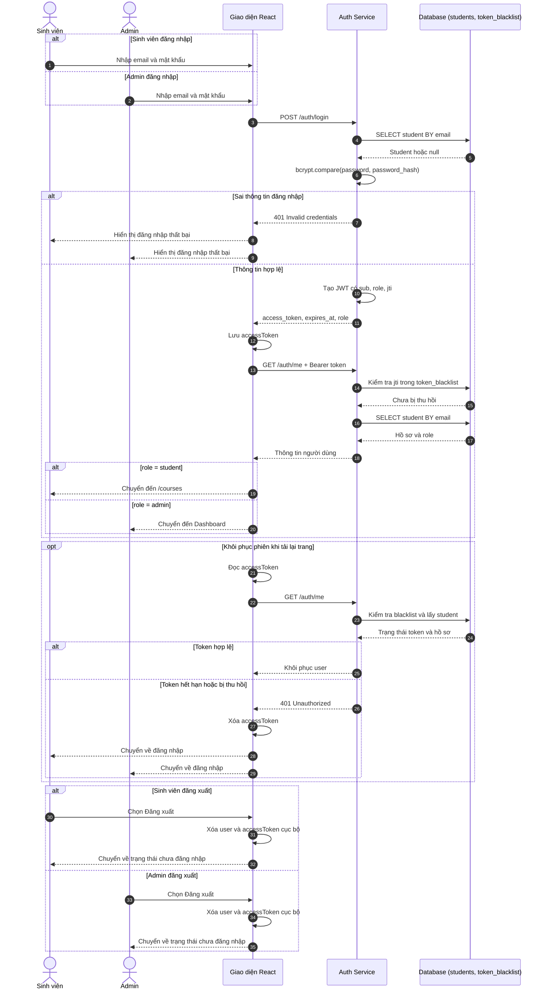
```mermaid
sequenceDiagram
    autonumber
    actor SV as Sinh viên
    actor AD as Admin
    participant UI as Giao diện React
    participant SVC as Auth Service
    participant DB as Database (students, token_blacklist)

    alt Sinh viên đăng nhập
        SV->>UI: Nhập email và mật khẩu
    else Admin đăng nhập
        AD->>UI: Nhập email và mật khẩu
    end
    UI->>SVC: POST /auth/login
    SVC->>DB: SELECT student BY email
    DB-->>SVC: Student hoặc null
    SVC->>SVC: bcrypt.compare(password, password_hash)

    alt Sai thông tin đăng nhập
        SVC-->>UI: 401 Invalid credentials
        UI-->>SV: Hiển thị đăng nhập thất bại
        UI-->>AD: Hiển thị đăng nhập thất bại
    else Thông tin hợp lệ
        SVC->>SVC: Tạo JWT có sub, role, jti
        SVC-->>UI: access_token, expires_at, role
        UI->>UI: Lưu accessToken
        UI->>SVC: GET /auth/me + Bearer token
        SVC->>DB: Kiểm tra jti trong token_blacklist
        DB-->>SVC: Chưa bị thu hồi
        SVC->>DB: SELECT student BY email
        DB-->>SVC: Hồ sơ và role
        SVC-->>UI: Thông tin người dùng
        alt role = student
            UI-->>SV: Chuyển đến /courses
        else role = admin
            UI-->>AD: Chuyển đến Dashboard
        end
    end

    opt Khôi phục phiên khi tải lại trang
        UI->>UI: Đọc accessToken
        UI->>SVC: GET /auth/me
        SVC->>DB: Kiểm tra blacklist và lấy student
        DB-->>SVC: Trạng thái token và hồ sơ
        alt Token hợp lệ
            SVC-->>UI: Khôi phục user
        else Token hết hạn hoặc bị thu hồi
            SVC-->>UI: 401 Unauthorized
            UI->>UI: Xóa accessToken
            UI-->>SV: Chuyển về đăng nhập
            UI-->>AD: Chuyển về đăng nhập
        end
    end

    alt Sinh viên đăng xuất
        SV->>UI: Chọn Đăng xuất
        UI->>UI: Xóa user và accessToken cục bộ
        UI-->>SV: Chuyển về trạng thái chưa đăng nhập
    else Admin đăng xuất
        AD->>UI: Chọn Đăng xuất
        UI->>UI: Xóa user và accessToken cục bộ
        UI-->>AD: Chuyển về trạng thái chưa đăng nhập
    end
```

## 3. Xem và cập nhật hồ sơ

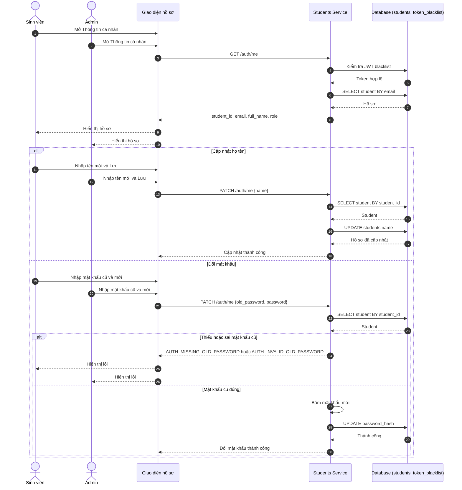
```mermaid
sequenceDiagram
    autonumber
    actor SV as Sinh viên
    actor AD as Admin
    participant UI as Giao diện hồ sơ
    participant SVC as Students Service
    participant DB as Database (students, token_blacklist)

    SV->>UI: Mở Thông tin cá nhân
    AD->>UI: Mở Thông tin cá nhân
    UI->>SVC: GET /auth/me
    SVC->>DB: Kiểm tra JWT blacklist
    DB-->>SVC: Token hợp lệ
    SVC->>DB: SELECT student BY email
    DB-->>SVC: Hồ sơ
    SVC-->>UI: student_id, email, full_name, role
    UI-->>SV: Hiển thị hồ sơ
    UI-->>AD: Hiển thị hồ sơ

    alt Cập nhật họ tên
        SV->>UI: Nhập tên mới và Lưu
        AD->>UI: Nhập tên mới và Lưu
        UI->>SVC: PATCH /auth/me {name}
        SVC->>DB: SELECT student BY student_id
        DB-->>SVC: Student
        SVC->>DB: UPDATE students.name
        DB-->>SVC: Hồ sơ đã cập nhật
        SVC-->>UI: Cập nhật thành công
    else Đổi mật khẩu
        SV->>UI: Nhập mật khẩu cũ và mới
        AD->>UI: Nhập mật khẩu cũ và mới
        UI->>SVC: PATCH /auth/me {old_password, password}
        SVC->>DB: SELECT student BY student_id
        DB-->>SVC: Student
        alt Thiếu hoặc sai mật khẩu cũ
            SVC-->>UI: AUTH_MISSING_OLD_PASSWORD hoặc AUTH_INVALID_OLD_PASSWORD
            UI-->>SV: Hiển thị lỗi
            UI-->>AD: Hiển thị lỗi
        else Mật khẩu cũ đúng
            SVC->>SVC: Băm mật khẩu mới
            SVC->>DB: UPDATE password_hash
            DB-->>SVC: Thành công
            SVC-->>UI: Đổi mật khẩu thành công
        end
    end
```

## 4. Admin xem Dashboard thống kê

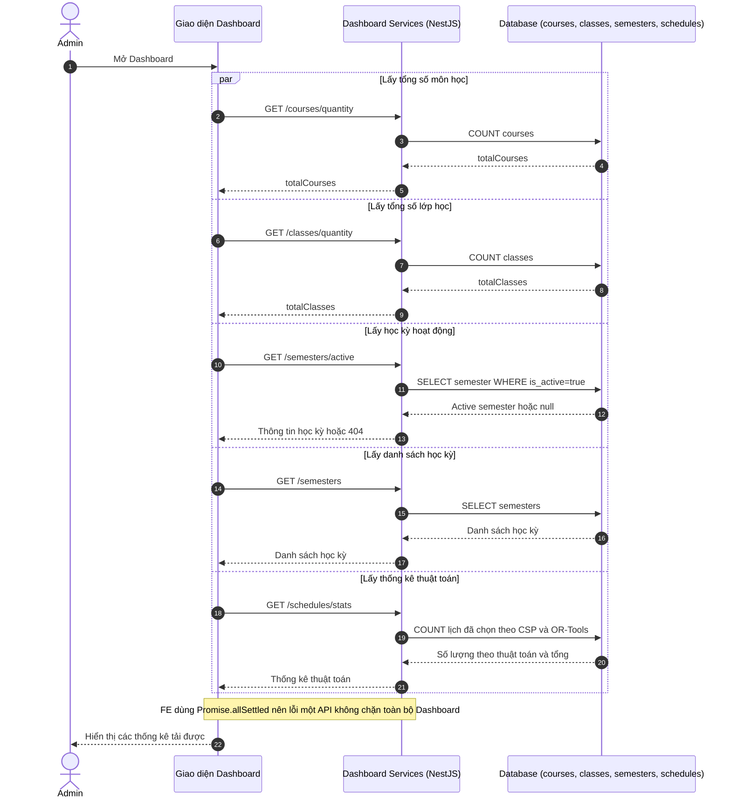
```mermaid
sequenceDiagram
    autonumber
    actor AD as Admin
    participant UI as Giao diện Dashboard
    participant SVC as Dashboard Services (NestJS)
    participant DB as Database (courses, classes, semesters, schedules)

    AD->>UI: Mở Dashboard
    par Lấy tổng số môn học
        UI->>SVC: GET /courses/quantity
        SVC->>DB: COUNT courses
        DB-->>SVC: totalCourses
        SVC-->>UI: totalCourses
    and Lấy tổng số lớp học
        UI->>SVC: GET /classes/quantity
        SVC->>DB: COUNT classes
        DB-->>SVC: totalClasses
        SVC-->>UI: totalClasses
    and Lấy học kỳ hoạt động
        UI->>SVC: GET /semesters/active
        SVC->>DB: SELECT semester WHERE is_active=true
        DB-->>SVC: Active semester hoặc null
        SVC-->>UI: Thông tin học kỳ hoặc 404
    and Lấy danh sách học kỳ
        UI->>SVC: GET /semesters
        SVC->>DB: SELECT semesters
        DB-->>SVC: Danh sách học kỳ
        SVC-->>UI: Danh sách học kỳ
    and Lấy thống kê thuật toán
        UI->>SVC: GET /schedules/stats
        SVC->>DB: COUNT lịch đã chọn theo CSP và OR-Tools
        DB-->>SVC: Số lượng theo thuật toán và tổng
        SVC-->>UI: Thống kê thuật toán
    end

    Note over UI,SVC: FE dùng Promise.allSettled nên lỗi một API không chặn toàn bộ Dashboard
    UI-->>AD: Hiển thị các thống kê tải được
```

## 5. Admin quản lý học kỳ

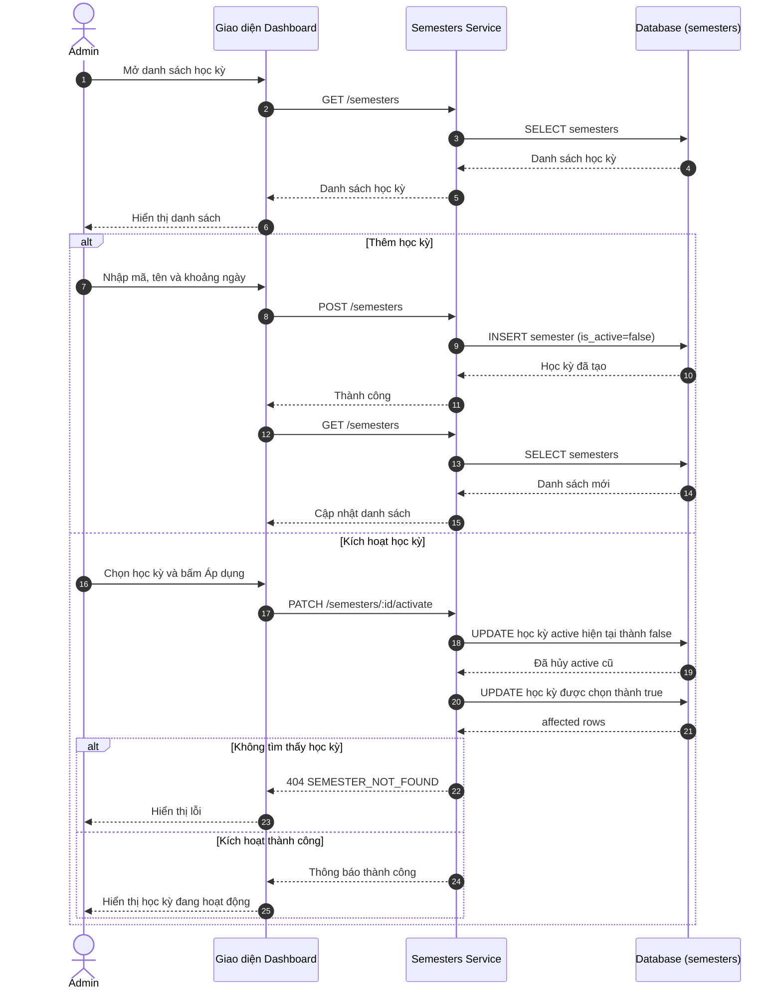
```mermaid
sequenceDiagram
    autonumber
    actor AD as Admin
    participant UI as Giao diện Dashboard
    participant SVC as Semesters Service
    participant DB as Database (semesters)

    AD->>UI: Mở danh sách học kỳ
    UI->>SVC: GET /semesters
    SVC->>DB: SELECT semesters
    DB-->>SVC: Danh sách học kỳ
    SVC-->>UI: Danh sách học kỳ
    UI-->>AD: Hiển thị danh sách

    alt Thêm học kỳ
        AD->>UI: Nhập mã, tên và khoảng ngày
        UI->>SVC: POST /semesters
        SVC->>DB: INSERT semester (is_active=false)
        DB-->>SVC: Học kỳ đã tạo
        SVC-->>UI: Thành công
        UI->>SVC: GET /semesters
        SVC->>DB: SELECT semesters
        DB-->>SVC: Danh sách mới
        SVC-->>UI: Cập nhật danh sách
    else Kích hoạt học kỳ
        AD->>UI: Chọn học kỳ và bấm Áp dụng
        UI->>SVC: PATCH /semesters/:id/activate
        SVC->>DB: UPDATE học kỳ active hiện tại thành false
        DB-->>SVC: Đã hủy active cũ
        SVC->>DB: UPDATE học kỳ được chọn thành true
        DB-->>SVC: affected rows
        alt Không tìm thấy học kỳ
            SVC-->>UI: 404 SEMESTER_NOT_FOUND
            UI-->>AD: Hiển thị lỗi
        else Kích hoạt thành công
            SVC-->>UI: Thông báo thành công
            UI-->>AD: Hiển thị học kỳ đang hoạt động
        end
    end
```

## 6. Admin quản lý môn học

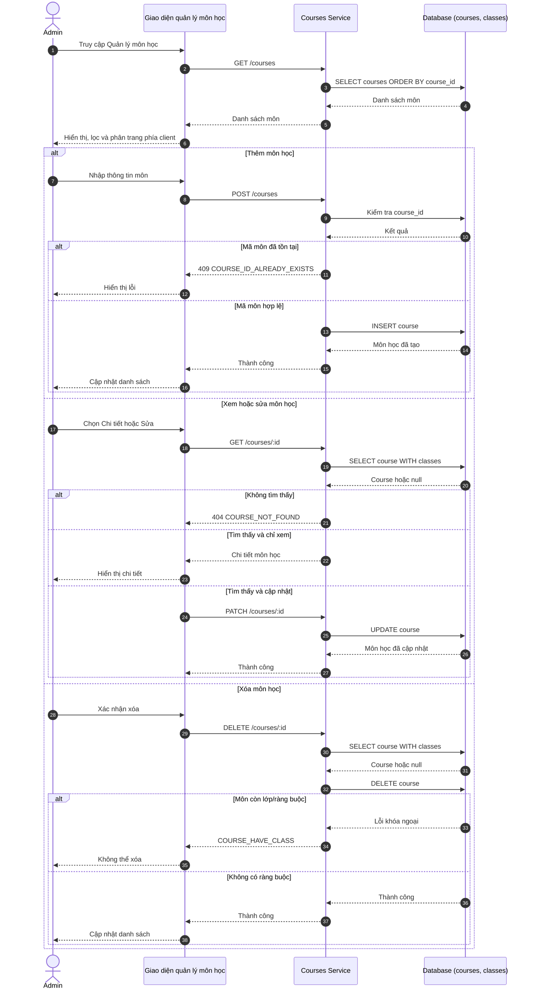
```mermaid
sequenceDiagram
    autonumber
    actor AD as Admin
    participant UI as Giao diện quản lý môn học
    participant SVC as Courses Service
    participant DB as Database (courses, classes)

    AD->>UI: Truy cập Quản lý môn học
    UI->>SVC: GET /courses
    SVC->>DB: SELECT courses ORDER BY course_id
    DB-->>SVC: Danh sách môn
    SVC-->>UI: Danh sách môn
    UI-->>AD: Hiển thị, lọc và phân trang phía client

    alt Thêm môn học
        AD->>UI: Nhập thông tin môn
        UI->>SVC: POST /courses
        SVC->>DB: Kiểm tra course_id
        DB-->>SVC: Kết quả
        alt Mã môn đã tồn tại
            SVC-->>UI: 409 COURSE_ID_ALREADY_EXISTS
            UI-->>AD: Hiển thị lỗi
        else Mã môn hợp lệ
            SVC->>DB: INSERT course
            DB-->>SVC: Môn học đã tạo
            SVC-->>UI: Thành công
            UI-->>AD: Cập nhật danh sách
        end
    else Xem hoặc sửa môn học
        AD->>UI: Chọn Chi tiết hoặc Sửa
        UI->>SVC: GET /courses/:id
        SVC->>DB: SELECT course WITH classes
        DB-->>SVC: Course hoặc null
        alt Không tìm thấy
            SVC-->>UI: 404 COURSE_NOT_FOUND
        else Tìm thấy và chỉ xem
            SVC-->>UI: Chi tiết môn học
            UI-->>AD: Hiển thị chi tiết
        else Tìm thấy và cập nhật
            UI->>SVC: PATCH /courses/:id
            SVC->>DB: UPDATE course
            DB-->>SVC: Môn học đã cập nhật
            SVC-->>UI: Thành công
        end
    else Xóa môn học
        AD->>UI: Xác nhận xóa
        UI->>SVC: DELETE /courses/:id
        SVC->>DB: SELECT course WITH classes
        DB-->>SVC: Course hoặc null
        SVC->>DB: DELETE course
        alt Môn còn lớp/ràng buộc
            DB-->>SVC: Lỗi khóa ngoại
            SVC-->>UI: COURSE_HAVE_CLASS
            UI-->>AD: Không thể xóa
        else Không có ràng buộc
            DB-->>SVC: Thành công
            SVC-->>UI: Thành công
            UI-->>AD: Cập nhật danh sách
        end
    end
```

## 7. Admin quản lý lớp học

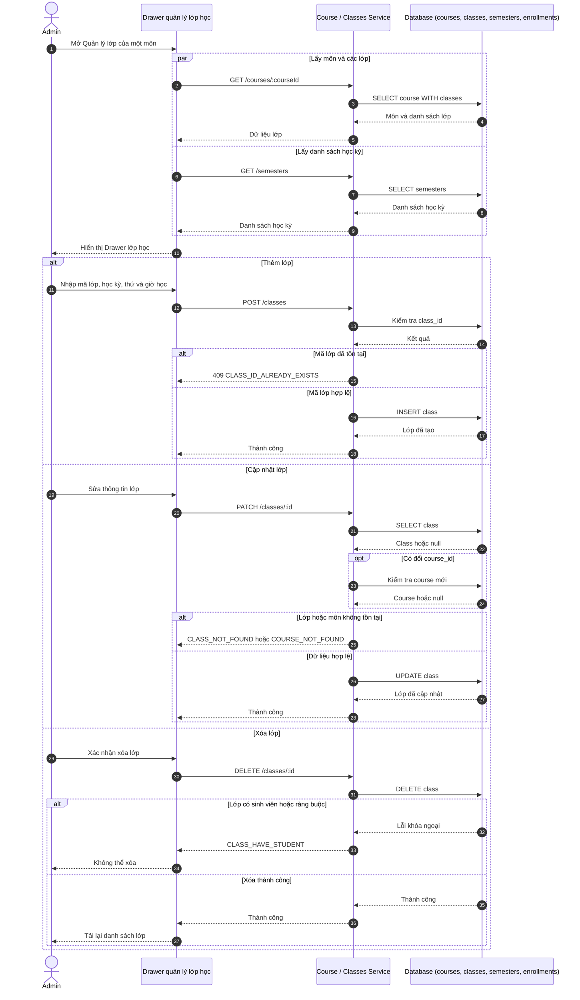
```mermaid
sequenceDiagram
    autonumber
    actor AD as Admin
    participant UI as Drawer quản lý lớp học
    participant SVC as Course / Classes Service
    participant DB as Database (courses, classes, semesters, enrollments)

    AD->>UI: Mở Quản lý lớp của một môn
    par Lấy môn và các lớp
        UI->>SVC: GET /courses/:courseId
        SVC->>DB: SELECT course WITH classes
        DB-->>SVC: Môn và danh sách lớp
        SVC-->>UI: Dữ liệu lớp
    and Lấy danh sách học kỳ
        UI->>SVC: GET /semesters
        SVC->>DB: SELECT semesters
        DB-->>SVC: Danh sách học kỳ
        SVC-->>UI: Danh sách học kỳ
    end
    UI-->>AD: Hiển thị Drawer lớp học

    alt Thêm lớp
        AD->>UI: Nhập mã lớp, học kỳ, thứ và giờ học
        UI->>SVC: POST /classes
        SVC->>DB: Kiểm tra class_id
        DB-->>SVC: Kết quả
        alt Mã lớp đã tồn tại
            SVC-->>UI: 409 CLASS_ID_ALREADY_EXISTS
        else Mã lớp hợp lệ
            SVC->>DB: INSERT class
            DB-->>SVC: Lớp đã tạo
            SVC-->>UI: Thành công
        end
    else Cập nhật lớp
        AD->>UI: Sửa thông tin lớp
        UI->>SVC: PATCH /classes/:id
        SVC->>DB: SELECT class
        DB-->>SVC: Class hoặc null
        opt Có đổi course_id
            SVC->>DB: Kiểm tra course mới
            DB-->>SVC: Course hoặc null
        end
        alt Lớp hoặc môn không tồn tại
            SVC-->>UI: CLASS_NOT_FOUND hoặc COURSE_NOT_FOUND
        else Dữ liệu hợp lệ
            SVC->>DB: UPDATE class
            DB-->>SVC: Lớp đã cập nhật
            SVC-->>UI: Thành công
        end
    else Xóa lớp
        AD->>UI: Xác nhận xóa lớp
        UI->>SVC: DELETE /classes/:id
        SVC->>DB: DELETE class
        alt Lớp có sinh viên hoặc ràng buộc
            DB-->>SVC: Lỗi khóa ngoại
            SVC-->>UI: CLASS_HAVE_STUDENT
            UI-->>AD: Không thể xóa
        else Xóa thành công
            DB-->>SVC: Thành công
            SVC-->>UI: Thành công
            UI-->>AD: Tải lại danh sách lớp
        end
    end
```

## 8. Admin import môn học và lớp học bằng Excel

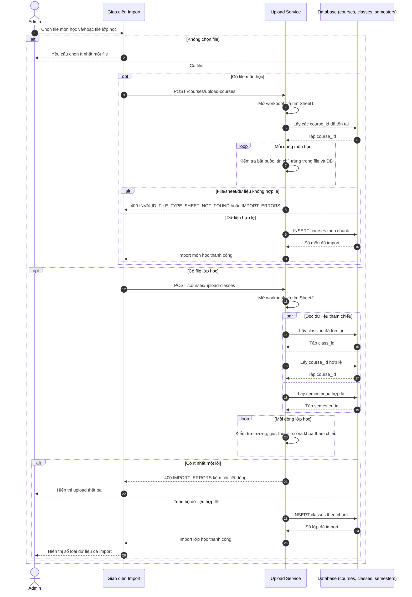
```mermaid
sequenceDiagram
    autonumber
    actor AD as Admin
    participant UI as Giao diện Import
    participant SVC as Upload Service
    participant DB as Database (courses, classes, semesters)

    AD->>UI: Chọn file môn học và/hoặc file lớp học
    alt Không chọn file
        UI-->>AD: Yêu cầu chọn ít nhất một file
    else Có file
        opt Có file môn học
            UI->>SVC: POST /courses/upload-courses
            SVC->>SVC: Mở workbook và tìm Sheet1
            SVC->>DB: Lấy các course_id đã tồn tại
            DB-->>SVC: Tập course_id
            loop Mỗi dòng môn học
                SVC->>SVC: Kiểm tra bắt buộc, tín chỉ, trùng trong file và DB
            end
            alt File/sheet/dữ liệu không hợp lệ
                SVC-->>UI: 400 INVALID_FILE_TYPE, SHEET_NOT_FOUND hoặc IMPORT_ERRORS
            else Dữ liệu hợp lệ
                SVC->>DB: INSERT courses theo chunk
                DB-->>SVC: Số môn đã import
                SVC-->>UI: Import môn học thành công
            end
        end

        opt Có file lớp học
            UI->>SVC: POST /courses/upload-classes
            SVC->>SVC: Mở workbook và tìm Sheet2
            par Đọc dữ liệu tham chiếu
                SVC->>DB: Lấy class_id đã tồn tại
                DB-->>SVC: Tập class_id
            and
                SVC->>DB: Lấy course_id hợp lệ
                DB-->>SVC: Tập course_id
            and
                SVC->>DB: Lấy semester_id hợp lệ
                DB-->>SVC: Tập semester_id
            end
            loop Mỗi dòng lớp học
                SVC->>SVC: Kiểm tra trường, giờ, thứ, sĩ số và khóa tham chiếu
            end
            alt Có ít nhất một lỗi
                SVC-->>UI: 400 IMPORT_ERRORS kèm chi tiết dòng
                UI-->>AD: Hiển thị upload thất bại
            else Toàn bộ dữ liệu hợp lệ
                SVC->>DB: INSERT classes theo chunk
                DB-->>SVC: Số lớp đã import
                SVC-->>UI: Import lớp học thành công
                UI-->>AD: Hiển thị số loại dữ liệu đã import
            end
        end
    end
```

## 9. Sinh viên chọn môn, thay thế đăng ký và khởi động sinh lịch

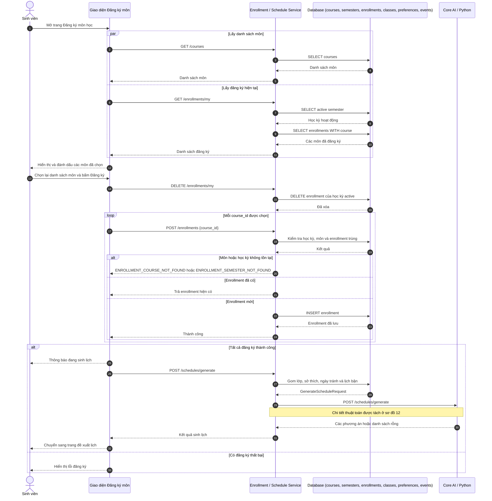
```mermaid
sequenceDiagram
    autonumber
    actor SV as Sinh viên
    participant UI as Giao diện Đăng ký môn
    participant SVC as Enrollment / Schedule Service
    participant DB as Database (courses, semesters, enrollments, classes, preferences, events)
    participant CORE as Core AI / Python

    SV->>UI: Mở trang Đăng ký môn học
    par Lấy danh sách môn
        UI->>SVC: GET /courses
        SVC->>DB: SELECT courses
        DB-->>SVC: Danh sách môn
        SVC-->>UI: Danh sách môn
    and Lấy đăng ký hiện tại
        UI->>SVC: GET /enrollments/my
        SVC->>DB: SELECT active semester
        DB-->>SVC: Học kỳ hoạt động
        SVC->>DB: SELECT enrollments WITH course
        DB-->>SVC: Các môn đã đăng ký
        SVC-->>UI: Danh sách đăng ký
    end
    UI-->>SV: Hiển thị và đánh dấu các môn đã chọn

    SV->>UI: Chọn lại danh sách môn và bấm Đăng ký
    UI->>SVC: DELETE /enrollments/my
    SVC->>DB: DELETE enrollment của học kỳ active
    DB-->>SVC: Đã xóa

    loop Mỗi course_id được chọn
        UI->>SVC: POST /enrollments {course_id}
        SVC->>DB: Kiểm tra học kỳ, môn và enrollment trùng
        DB-->>SVC: Kết quả
        alt Môn hoặc học kỳ không tồn tại
            SVC-->>UI: ENROLLMENT_COURSE_NOT_FOUND hoặc ENROLLMENT_SEMESTER_NOT_FOUND
        else Enrollment đã có
            SVC-->>UI: Trả enrollment hiện có
        else Enrollment mới
            SVC->>DB: INSERT enrollment
            DB-->>SVC: Enrollment đã lưu
            SVC-->>UI: Thành công
        end
    end

    alt Tất cả đăng ký thành công
        UI-->>SV: Thông báo đang sinh lịch
        UI->>SVC: POST /schedules/generate
        SVC->>DB: Gom lớp, sở thích, ngày tránh và lịch bận
        DB-->>SVC: GenerateScheduleRequest
        SVC->>CORE: POST /schedules/generate
        Note over SVC,CORE: Chi tiết thuật toán được tách ở sơ đồ 12
        CORE-->>SVC: Các phương án hoặc danh sách rỗng
        SVC-->>UI: Kết quả sinh lịch
        UI-->>SV: Chuyển sang trang đề xuất lịch
    else Có đăng ký thất bại
        UI-->>SV: Hiển thị lỗi đăng ký
    end
```

## 10. Sinh viên cấu hình buổi học mong muốn và ngày tránh

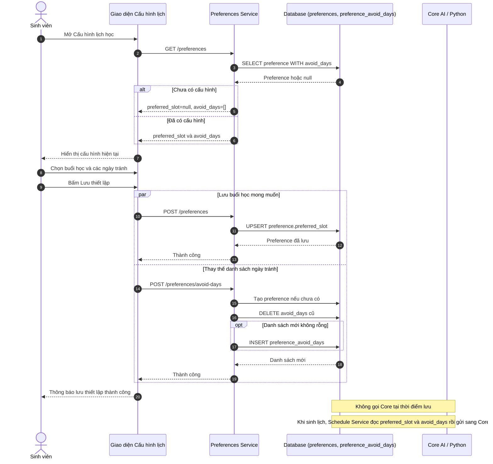
```mermaid
sequenceDiagram
    autonumber
    actor SV as Sinh viên
    participant UI as Giao diện Cấu hình lịch
    participant SVC as Preferences Service
    participant DB as Database (preferences, preference_avoid_days)
    participant CORE as Core AI / Python

    SV->>UI: Mở Cấu hình lịch học
    UI->>SVC: GET /preferences
    SVC->>DB: SELECT preference WITH avoid_days
    DB-->>SVC: Preference hoặc null
    alt Chưa có cấu hình
        SVC-->>UI: preferred_slot=null, avoid_days=[]
    else Đã có cấu hình
        SVC-->>UI: preferred_slot và avoid_days
    end
    UI-->>SV: Hiển thị cấu hình hiện tại

    SV->>UI: Chọn buổi học và các ngày tránh
    SV->>UI: Bấm Lưu thiết lập
    par Lưu buổi học mong muốn
        UI->>SVC: POST /preferences
        SVC->>DB: UPSERT preference.preferred_slot
        DB-->>SVC: Preference đã lưu
        SVC-->>UI: Thành công
    and Thay thế danh sách ngày tránh
        UI->>SVC: POST /preferences/avoid-days
        SVC->>DB: Tạo preference nếu chưa có
        SVC->>DB: DELETE avoid_days cũ
        opt Danh sách mới không rỗng
            SVC->>DB: INSERT preference_avoid_days
        end
        DB-->>SVC: Danh sách mới
        SVC-->>UI: Thành công
    end
    UI-->>SV: Thông báo lưu thiết lập thành công

    Note over DB,CORE: Không gọi Core tại thời điểm lưu
    Note over DB,CORE: Khi sinh lịch, Schedule Service đọc preferred_slot và avoid_days rồi gửi sang Core
```

## 11. Sinh viên quản lý khung giờ bận cá nhân

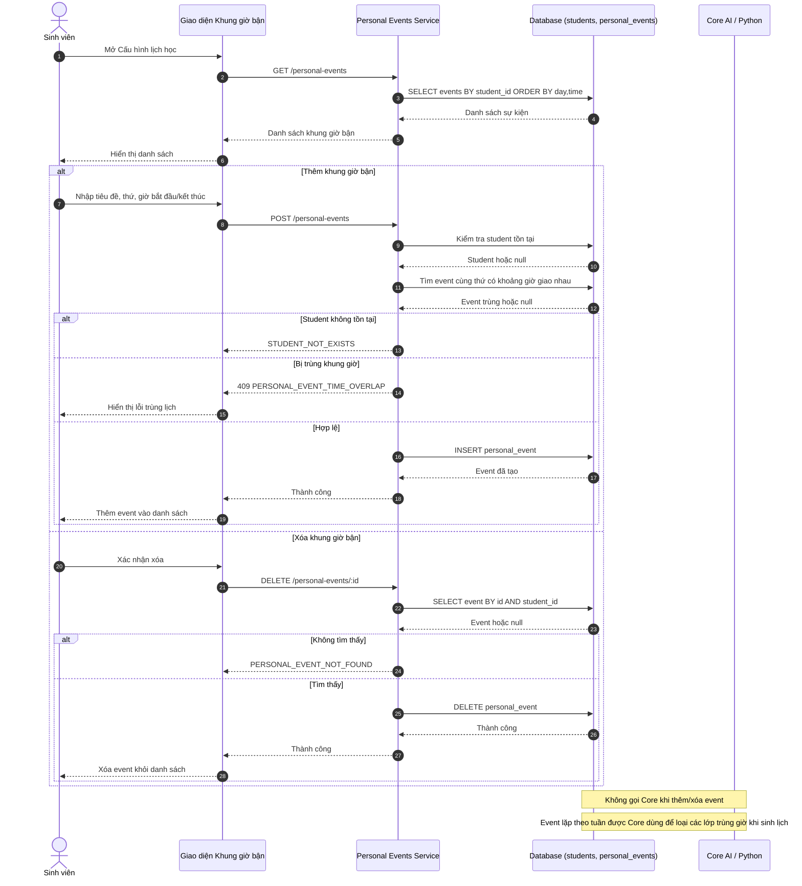
```mermaid
sequenceDiagram
    autonumber
    actor SV as Sinh viên
    participant UI as Giao diện Khung giờ bận
    participant SVC as Personal Events Service
    participant DB as Database (students, personal_events)
    participant CORE as Core AI / Python

    SV->>UI: Mở Cấu hình lịch học
    UI->>SVC: GET /personal-events
    SVC->>DB: SELECT events BY student_id ORDER BY day,time
    DB-->>SVC: Danh sách sự kiện
    SVC-->>UI: Danh sách khung giờ bận
    UI-->>SV: Hiển thị danh sách

    alt Thêm khung giờ bận
        SV->>UI: Nhập tiêu đề, thứ, giờ bắt đầu/kết thúc
        UI->>SVC: POST /personal-events
        SVC->>DB: Kiểm tra student tồn tại
        DB-->>SVC: Student hoặc null
        SVC->>DB: Tìm event cùng thứ có khoảng giờ giao nhau
        DB-->>SVC: Event trùng hoặc null
        alt Student không tồn tại
            SVC-->>UI: STUDENT_NOT_EXISTS
        else Bị trùng khung giờ
            SVC-->>UI: 409 PERSONAL_EVENT_TIME_OVERLAP
            UI-->>SV: Hiển thị lỗi trùng lịch
        else Hợp lệ
            SVC->>DB: INSERT personal_event
            DB-->>SVC: Event đã tạo
            SVC-->>UI: Thành công
            UI-->>SV: Thêm event vào danh sách
        end
    else Xóa khung giờ bận
        SV->>UI: Xác nhận xóa
        UI->>SVC: DELETE /personal-events/:id
        SVC->>DB: SELECT event BY id AND student_id
        DB-->>SVC: Event hoặc null
        alt Không tìm thấy
            SVC-->>UI: PERSONAL_EVENT_NOT_FOUND
        else Tìm thấy
            SVC->>DB: DELETE personal_event
            DB-->>SVC: Thành công
            SVC-->>UI: Thành công
            UI-->>SV: Xóa event khỏi danh sách
        end
    end

    Note over DB,CORE: Không gọi Core khi thêm/xóa event
    Note over DB,CORE: Event lặp theo tuần được Core dùng để loại các lớp trùng giờ khi sinh lịch
```

## 12. Sinh và xếp hạng thời khóa biểu tối ưu

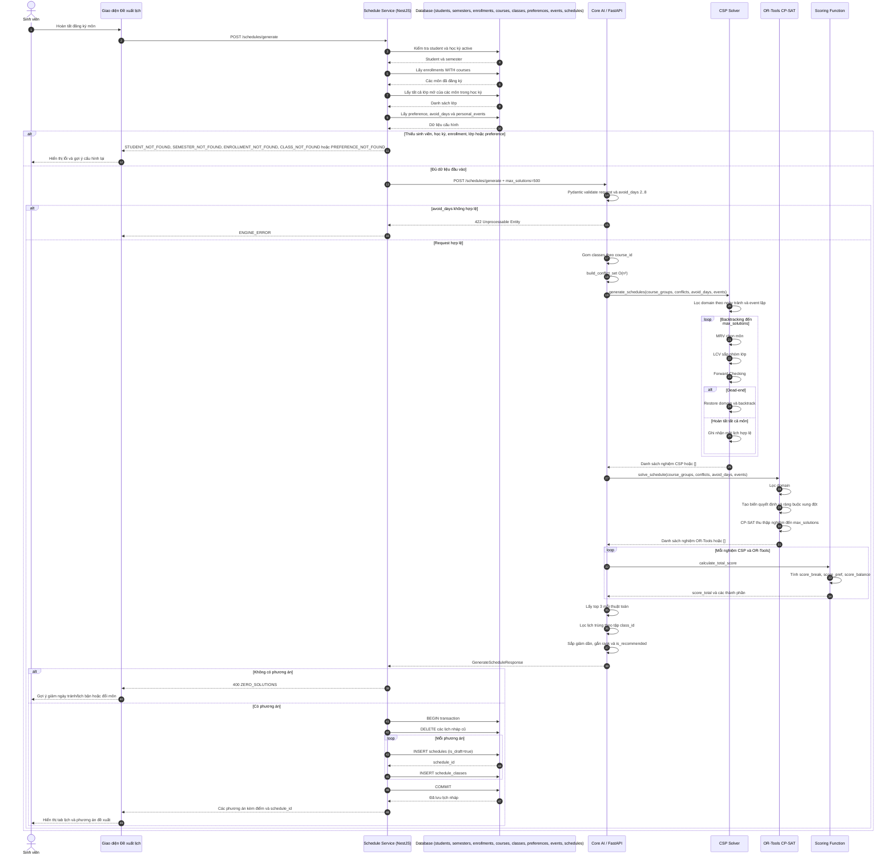
```mermaid
sequenceDiagram
    autonumber
    actor SV as Sinh viên
    participant UI as Giao diện Đề xuất lịch
    participant SVC as Schedule Service (NestJS)
    participant DB as Database (students, semesters, enrollments, courses, classes, preferences, events, schedules)
    participant CORE as Core AI / FastAPI
    participant CSP as CSP Solver
    participant ORT as OR-Tools CP-SAT
    participant SCORE as Scoring Function

    SV->>UI: Hoàn tất đăng ký môn
    UI->>SVC: POST /schedules/generate

    SVC->>DB: Kiểm tra student và học kỳ active
    DB-->>SVC: Student và semester
    SVC->>DB: Lấy enrollments WITH courses
    DB-->>SVC: Các môn đã đăng ký
    SVC->>DB: Lấy tất cả lớp mở của các môn trong học kỳ
    DB-->>SVC: Danh sách lớp
    SVC->>DB: Lấy preference, avoid_days và personal_events
    DB-->>SVC: Dữ liệu cấu hình

    alt Thiếu sinh viên, học kỳ, enrollment, lớp hoặc preference
        SVC-->>UI: STUDENT_NOT_FOUND, SEMESTER_NOT_FOUND, ENROLLMENT_NOT_FOUND, CLASS_NOT_FOUND hoặc PREFERENCE_NOT_FOUND
        UI-->>SV: Hiển thị lỗi và gợi ý cấu hình lại
    else Đủ dữ liệu đầu vào
        SVC->>CORE: POST /schedules/generate + max_solutions=500
        CORE->>CORE: Pydantic validate request và avoid_days 2..8
        alt avoid_days không hợp lệ
            CORE-->>SVC: 422 Unprocessable Entity
            SVC-->>UI: ENGINE_ERROR
        else Request hợp lệ
            CORE->>CORE: Gom classes theo course_id
            CORE->>CORE: build_conflict_set O(n²)

            CORE->>CSP: generate_schedules(course_groups, conflicts, avoid_days, events)
            CSP->>CSP: Lọc domain theo ngày tránh và event lặp
            loop Backtracking đến max_solutions
                CSP->>CSP: MRV chọn môn
                CSP->>CSP: LCV sắp nhóm lớp
                CSP->>CSP: Forward Checking
                alt Dead-end
                    CSP->>CSP: Restore domain và backtrack
                else Hoàn tất tất cả môn
                    CSP->>CSP: Ghi nhận một lịch hợp lệ
                end
            end
            CSP-->>CORE: Danh sách nghiệm CSP hoặc []

            CORE->>ORT: solve_schedule(course_groups, conflicts, avoid_days, events)
            ORT->>ORT: Lọc domain
            ORT->>ORT: Tạo biến quyết định và ràng buộc xung đột
            ORT->>ORT: CP-SAT thu thập nghiệm đến max_solutions
            ORT-->>CORE: Danh sách nghiệm OR-Tools hoặc []

            loop Mỗi nghiệm CSP và OR-Tools
                CORE->>SCORE: calculate_total_score
                SCORE->>SCORE: Tính score_break, score_pref, score_balance
                SCORE-->>CORE: score_total và các thành phần
            end
            CORE->>CORE: Lấy top 3 mỗi thuật toán
            CORE->>CORE: Lọc lịch trùng theo tập class_id
            CORE->>CORE: Sắp giảm dần, gắn rank và is_recommended
            CORE-->>SVC: GenerateScheduleResponse

            alt Không có phương án
                SVC-->>UI: 400 ZERO_SOLUTIONS
                UI-->>SV: Gợi ý giảm ngày tránh/lịch bận hoặc đổi môn
            else Có phương án
                SVC->>DB: BEGIN transaction
                SVC->>DB: DELETE các lịch nháp cũ
                loop Mỗi phương án
                    SVC->>DB: INSERT schedules (is_draft=true)
                    DB-->>SVC: schedule_id
                    SVC->>DB: INSERT schedule_classes
                end
                SVC->>DB: COMMIT
                DB-->>SVC: Đã lưu lịch nháp
                SVC-->>UI: Các phương án kèm điểm và schedule_id
                UI-->>SV: Hiển thị tab lịch và phương án đề xuất
            end
        end
    end
```

## 13. Sinh viên xác nhận phương án lịch

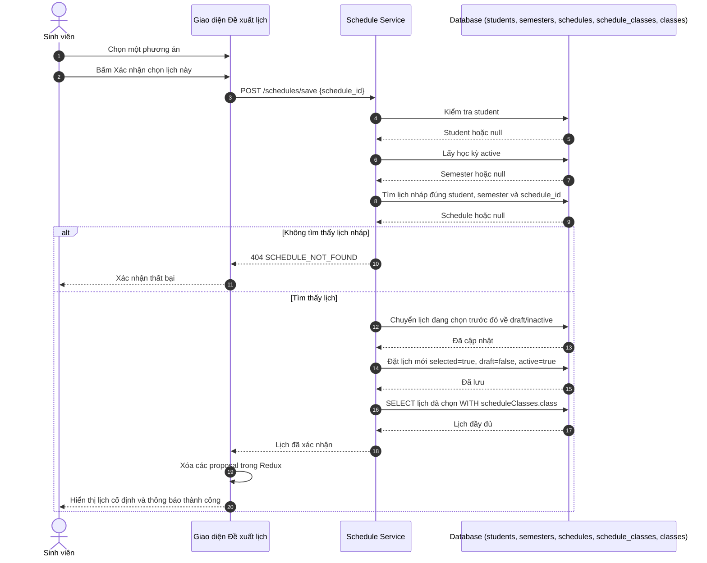
```mermaid
sequenceDiagram
    autonumber
    actor SV as Sinh viên
    participant UI as Giao diện Đề xuất lịch
    participant SVC as Schedule Service
    participant DB as Database (students, semesters, schedules, schedule_classes, classes)

    SV->>UI: Chọn một phương án
    SV->>UI: Bấm Xác nhận chọn lịch này
    UI->>SVC: POST /schedules/save {schedule_id}
    SVC->>DB: Kiểm tra student
    DB-->>SVC: Student hoặc null
    SVC->>DB: Lấy học kỳ active
    DB-->>SVC: Semester hoặc null
    SVC->>DB: Tìm lịch nháp đúng student, semester và schedule_id
    DB-->>SVC: Schedule hoặc null

    alt Không tìm thấy lịch nháp
        SVC-->>UI: 404 SCHEDULE_NOT_FOUND
        UI-->>SV: Xác nhận thất bại
    else Tìm thấy lịch
        SVC->>DB: Chuyển lịch đang chọn trước đó về draft/inactive
        DB-->>SVC: Đã cập nhật
        SVC->>DB: Đặt lịch mới selected=true, draft=false, active=true
        DB-->>SVC: Đã lưu
        SVC->>DB: SELECT lịch đã chọn WITH scheduleClasses.class
        DB-->>SVC: Lịch đầy đủ
        SVC-->>UI: Lịch đã xác nhận
        UI->>UI: Xóa các proposal trong Redux
        UI-->>SV: Hiển thị lịch cố định và thông báo thành công
    end
```

## 14. Sinh viên xem lịch học đã xác nhận

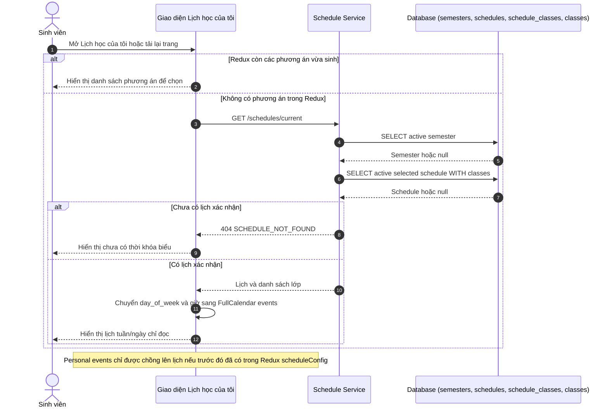
```mermaid
sequenceDiagram
    autonumber
    actor SV as Sinh viên
    participant UI as Giao diện Lịch học của tôi
    participant SVC as Schedule Service
    participant DB as Database (semesters, schedules, schedule_classes, classes)

    SV->>UI: Mở Lịch học của tôi hoặc tải lại trang
    alt Redux còn các phương án vừa sinh
        UI-->>SV: Hiển thị danh sách phương án để chọn
    else Không có phương án trong Redux
        UI->>SVC: GET /schedules/current
        SVC->>DB: SELECT active semester
        DB-->>SVC: Semester hoặc null
        SVC->>DB: SELECT active selected schedule WITH classes
        DB-->>SVC: Schedule hoặc null
        alt Chưa có lịch xác nhận
            SVC-->>UI: 404 SCHEDULE_NOT_FOUND
            UI-->>SV: Hiển thị chưa có thời khóa biểu
        else Có lịch xác nhận
            SVC-->>UI: Lịch và danh sách lớp
            UI->>UI: Chuyển day_of_week và giờ sang FullCalendar events
            UI-->>SV: Hiển thị lịch tuần/ngày chỉ đọc
        end
    end

    Note over UI: Personal events chỉ được chồng lên lịch nếu trước đó đã có trong Redux scheduleConfig
```
